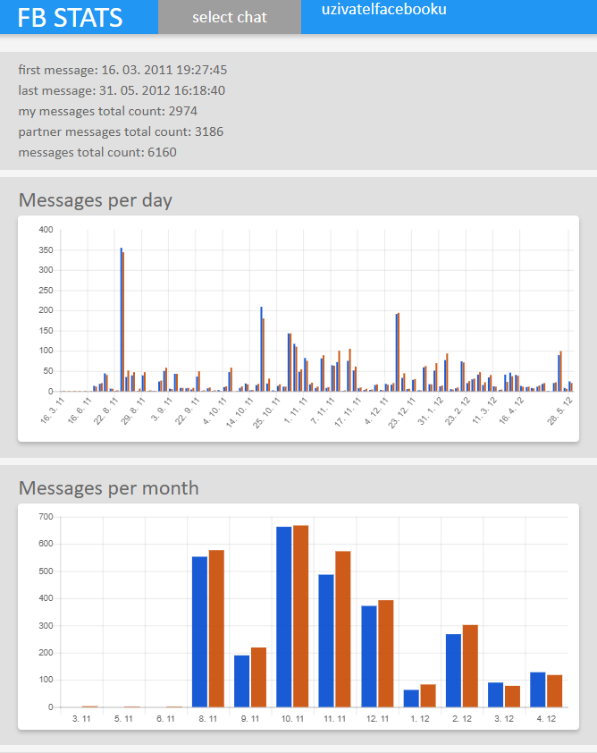
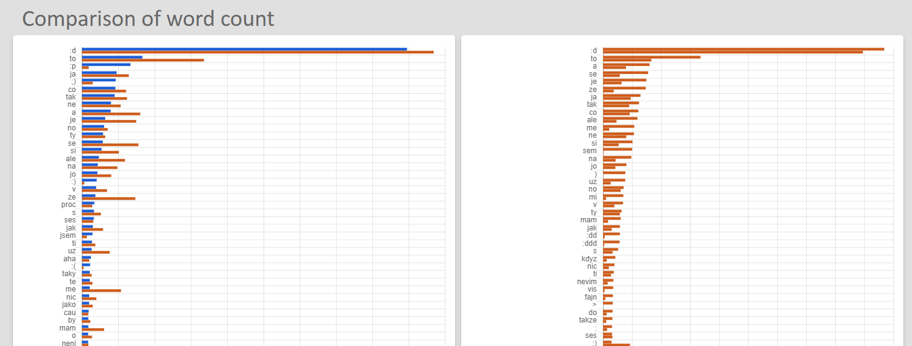

# Facebook messages statistics
This application can show you various data about your Facebook messages. It uses the facebook JSON data export to do this. 

It counts the messages per day/month/year. 

It also counts the words used.

This can show you chronic usage of words and interest of both sides in having a conversation.

How to use this:

1. Download JSON data export from Facebook
    - Go to settings -> your data on Facebook -> download your data -> select messages in JSON format
    - now you'll have to wait for Facebook to prepare your data for download (this can take up to half a day) 
    - you will get a notification that your data is ready
    - download your data
    
2. Extract your Facebook data in some folder
3. Download fbStatsApp.zip from Releases
4. Extract contents of the fbStatsApp.zip in your Facebook data folder
5. Run fbStatsApp.exe

This is still a very raw project. Hopefuly I'll get around to add more statistical function (and value) to this program. By now it is just a weekend project that I have done. I'm posting this publicly because someone could find it useful or entertaining.

This project is not affiliated with Facebook in any way.
